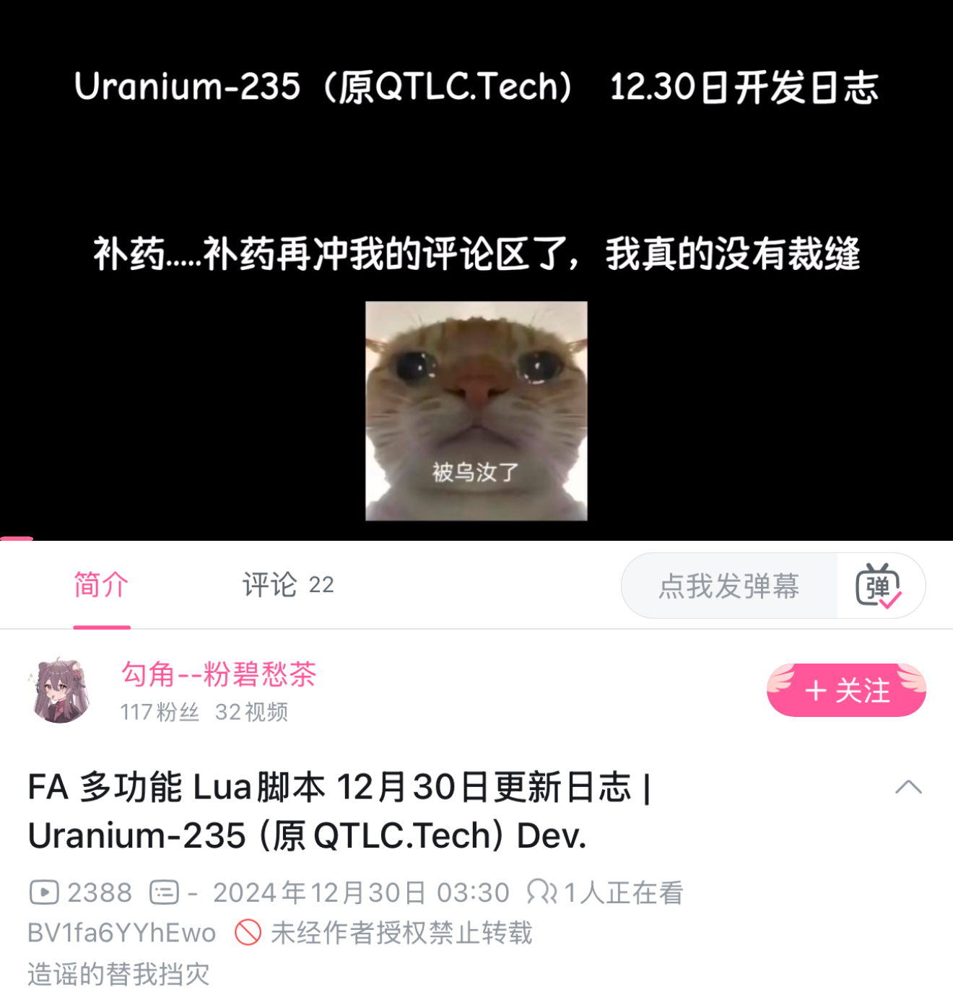

# 为什么U235是一坨屎

[](https://github.com/trekhleb/state-of-the-art-shitcode)

## 作者不止一次表明自己是完全原创




即便是评论区已经有人指出是论坛Lua集合体了，但作者仍然嘴硬，坚称该Lua为原创Lua，评论区疯狂爆典。

## 实际上这个Lua的大部分功能均为抄袭

### Wallbang Helper

完全抄袭自[论坛开源Lua](https://fatality.win/resources/866/)


甚至在注释中明确说明了“注意下面是wallbang的src”

### Kill Say \ Trash Talk

发言部分为抄袭[开源Lua](https://fatality.win/threads/15991/#post-138200)


最搞笑的是英文垃圾话变量名为"messageEN"，但中文变量名为"messageRU" (EN是英语的意思，但RU是俄语的意思）

有热心观众投稿，其发言内容也是抄袭来的。


### World Hitmark

抄袭自开源Lua，原作者因为抄袭问题过于严重已删帖。再次感谢U-235科技为Fatality脚本社区带来的贡献！


以上只是我们列举的，不代表作者实际抄袭的Lua只有这么多。

## Lua水平垃圾到令人发指

###  变量名不规范

```Lua
local air_open_nospread = false
local air_duck_open_nospread = false
local running_open_nosread = false
local slowwalk_open_nospread = false
local stand_open_nospread = false
local duck_open_nospread = false
```

在代码中，我们可以找到大量这类无意义的重复变量。甚至能将变量名打错，将"nospread"错打成"nosread"。

除此之外，还有更多令人招笑的变量名。

```Lua
--killsay
local EN_KillSay = gui.checkbox(gui.control_id('EN_KillSay'));

local CN_KillSay = gui.checkbox(gui.control_id('CN_KillSay'));
local rowA = gui.make_control('KillSay CN | OPEN [Lua API]', EN_KillSay); -- container
rowA:add(CN_KillSay);
local groupA = gui.ctx:find('visuals>local>misc');
groupA:add(rowA);


local Hit_Log = gui.checkbox(gui.control_id('Hit_Log'));

local Hurt_Log = gui.checkbox(gui.control_id('Hurt_Log'));
local rowB = gui.make_control('Hurt | Hit Log [Lua API]', Hit_Log); -- container
rowB:add(Hurt_Log);
local groupB = gui.ctx:find('misc>hud');
groupB:add(rowB);


local Crosshair_WaterMark = gui.checkbox(gui.control_id('Crosshair WaterMark'))

local Main_WaterMark = gui.checkbox(gui.control_id('Main_WaterMark'))
local Main_WaterMark2 = gui.checkbox(gui.control_id('Main_WaterMark2'))
local rowC = gui.make_control('Main_Glass  | Main_FA | Cross', Crosshair_WaterMark); -- container
rowC:add(Main_WaterMark);
rowC:add(Main_WaterMark2)

local groupC = gui.ctx:find('misc>windows');
groupC:add(rowC);


local air_auto_nospread = gui.checkbox(gui.control_id('air_auto_nospread'))
local ground_auto_nospread = gui.checkbox(gui.control_id('ground_auto_nospread'));
local rowD = gui.make_control('Ground | Air Auto Nospread', air_auto_nospread); -- container
rowD:add(ground_auto_nospread);
local groupD = gui.ctx:find('rage>aimbot>general');
groupD:add(rowD);
```

作者同时使用了高达三种变量命名法。

1. EN_Killsay，使用了下划线+大小写。
2. rowA，使用了大小写。
3. air_open_nospread，使用了下划线。

由此可见，作者的编码水平十分垃圾。

### "智能"无扩散

智能无扩散是本Lua中几乎唯一的原创，我们再来看看作者所谓的原创“智能无扩散”的代码。


由于脚本中充斥了大量的垃圾代码，我们摘取单个功能简单锐评。

```Lua
if speed ~= 0 and misc_slowwalk:get_value():get() == false and bit.band(lp.m_fFlags:get(), bit.lshift(1, 0)) == 1 
and bit.band(lp.m_fFlags:get(), bit.lshift(1, 1)) == 0 
and ground_auto_nospread:get_value():get() then
    if lp.m_bIsScoped:get() == true and speed <= 80 and lp:get_active_weapon():get_id() == 40 then
        running_open_nosread = true
        if running_open_nosread == true then
            force_nospread:set_value(true)
        end

    else
        running_open_nosread = false
   end
else
    running_open_nosread = false
    if running_open_nosread == false and slowwalk_open_nospread == false and air_open_nospread == false and stand_open_nospread == false and air_duck_open_nospread == false and duck_open_nospread == false and ground_auto_nospread:get_value():get() then
        force_nospread:set_value(false)
    end

end
```

这段代码中存在大量的硬编码，例如将速度写死为80，武器ID写死为40。在实际的编程中，这样是不规范的。

```Lua
    running_open_nosread = true
    if running_open_nosread == true then
        force_nospread:set_value(true)
    end
```

作者在设置了某个变量为True后，还要验证该变量是否为True。令人招笑。

```Lua
running_open_nosread = false
if running_open_nosread == false and slowwalk_open_nospread == false and air_open_nospread == false and stand_open_nospread == false and air_duck_open_nospread == false and duck_open_nospread == false and ground_auto_nospread:get_value():get() then
    force_nospread:set_value(false)
end
```

同样的，在设置某个变量为False后，作者也要验证该变量是否为False，还要逐一验证其他变量的是否为False。在实际编程中，这种做法是效率极低而且难以维护的。计算效率低，轻则可能会导致游戏FPS下降，重则将会导致全球变暖等全球性灾害。

以上就是本脚本作者的实际编程水平，我的评价是三岁小孩级别。

## 作者人品问题

### 爹，我是刘路啊！

以下均为热心网友投稿。

> 圈名:千束TINY kiko k1KO qq:13729148 3426827601  3409203702  2711364163 与我保持恋爱关系几个月 自称真名胡桃且自称在日本留学 之前和我说过自己名下有一台小米su7 福建省rog代理 日本和福建均有房产 经历了这几个月和他在一起 我发现了诸多疑点 例如和我说在日本上学 每天晚上要去打工挣钱 可光是我在群里看到他在打游戏的截图 不下5此所有社交软件的ip属地也在国内自称是使用的远控软件控制在国内电脑 就连名字也是骗我的


> 可是手机网易云的ip却是福建 这几个月里千束这个人可谓是“粘手坏”代言人 今天手机坏了 明天电脑坏了 后天耳机坏了 大后天键盘坏了 接下来让我们看看千束的不过脑子骗人


> 千束称自己的电脑显卡核心坏了 介于前面他自己说了是远控的在国内的电脑 可他自己把自己绕进去了 跟我说他cpu也被带走了 接下来最脑残的要来了 千束使用了跨国伸手修电脑 在日本拆开了国内的笔记本 XD 后被我发现 赶忙将自己的话改为他在日本的电脑^^


> 在日本留学长达三年的一个人竟不知道711便利店晚上打折的便当 还需要我来提醒他还说出了 便利店的饭凉米饭嚼不动 面条很糟 在这种情况下说出了连吃一个月泡面的逆天发言（每天晚上去打工到后面说自己存款就几十块）


> 昨天也就是 10.24日千束自称fa解绑在国内的电脑 sk并未解绑 但是到了今天 他的sk在国内的电脑上注入成功 并且国服ping22 也更加应证了千束并未在日本


> 和我在一起四个多月以来 名字也是骗我的 可笑吗 自称胡桃可其实际姓名：[隐私保护]


>  地址 手机号 都对的上 千束老师又要说自己是挡刀号了吗 xD 骗别人无所谓 骗我是不是太过分了？

*再次声明：以上内容均为投稿，我们不对该内容的真实性负责。*

### 偷图流女装


### DDoS高手


建议报警处理。

### 恶俗狗来了


2024年12月12日，U-235作者新建了一个Telegram频道，在自己的QQ空间和各大HvH聊天群中大肆宣传自己的开户籍频道。直至今日（2025年1月11日），U-235作者已经收获了高达十位甚至九位订阅者。


甚至带着自己的推荐码在自己十位甚至九位的频道中发送免费轰炸机器人链接。


# 嘴硬

当Lua第一时间被我们公开时，作者第一时间跳出来在自己的小群中发公告，公告内容如下：

> 各位用户不必惊慌，泄露的为最早的版本，那时我们并未进行售卖，写出来仅在朋友之间互相传播，内容和功能也是相当简陋，最新的版本代码进行了更多的优化和更多功能的添加

好的，那本Lua就是你最早的版本，朋友之间互相传播的。我们认同你的说法，但具体是不是只有你自己心里清楚咯！


当脚本被泄漏，第一时间想到的是嘴硬和否定，而不是承认和道歉。我们对该作者的行为不予评价，只是为购买该脚本的用户感到悲哀。当然我们不会去嘲讽和攻击购买者，因为他们是受害者。我们建议所有购买该脚本的用户进行退款维权。

## 嘲讽OG

MLC是世界著名的HvH Script作者。代表作有AI Peek，即使是后面脚本遭到泄漏、开源。其代码水平也是世界公认Tier 0。但U-235作者认为，MLC写不出来“自动无扩散”，爆典“有本事他们写一个开源”。


而我们还真的写了个更好更简短的开源了，甚至做了个[视频](https://www.bilibili.com/video/BV1ae6BYvEAa)教学原理。而我们敬爱的U-235作者却在评论区“冷嘲热讽”。始终认为自己的狗屎代码能“永远站在功能最前沿”。

> 我没意见啊


说又说不得，玩又玩不起。

## 对“多状态智能无扩散检测”的理性分析

Fatality加入官匹无扩散（No Spread \ NS）和强制无扩散 （Force No Spread \ FNS）后，这个问题便一直存在，并一直争吵不休。

以下是对我之前提到过的无扩散原理解释的引用。

> 通过随机数种子补偿的方法实现完全无扩散是很容易被检测的，所以现在的作弊都有移除扩散 (Remove Spread) 功能和强制移除扩散 (Force Remove Spread) 功能。在社区服务器中，移除扩散功能启动时，强制移除扩散功能一般是不可用的，因为没有必要这么做。但是在官匹中，两个功能则是完全不同的。
>
> 当移除扩散功能开启后，移除掉的扩散是通过另一种方法实现的，同样依赖于随机数种子。这种方法相对来说没有上面提到的方法那么简单粗暴有效，但是能够绕过Valve的检测，实现尽可能降低扩散的效果。当武器扩散较小时，效果很好。但武器扩散较大 (例如在空中) 时，效果则一般甚至打不中。这就是移除扩散和强制移除扩散的区别。
>
> 总体来说就是效果较差，但是不会被Valve检测到。但是当你使用强制移除扩散，Valve检测到然后更换了随机数种子之后，移除扩散也会失效。

所以为什么“假走”（Slow Walk）和下蹲状态下“不会消耗无扩散种子”呢？首先我要纠正一个特别弱智的说法，尽管“消耗种子”这个说法比较常见，但是这个说法还是错误的。实际上是Valve会在官匹服务器中检测无扩散行为，并且将可疑的射击标记为“Suspicious Shot” （可疑的射击）。当可疑的射击被计数满10次后，Valve将会对客户端发送一个与服务端不同步的随机数种子。这将会导致本地动画预测等功能失效。所以“种子”是不能被“消耗”的，如果你是一个普通的HvH玩家，我认为这种说法是相对直观的。但是作为一个开发者，你不能再用这种搞笑说法去误导普通用户。

那么已经有扩散预测了，命中率也就不再存在。命中率不存在的情况下，为什么需要开启强制无扩散？当你Slow Walk或者下蹲时，命中率已经够高了，此时是不是强制无扩散也就没有意义了。命中率够高的情况下，急停也没有作用。

综上所述，我认为该脚本所谓原创“多状态智能无扩散检测”是狗屁不通，一塌糊涂。其唯一有用的就是在空中“智能”开启无扩散，其区别实际上与把强制无扩散绑在空格键上的区别很小。而这份脚本要高达60大洋。

## 阴阳怪气

在该[视频](https://www.bilibili.com/video/BV162cjezEnV)中，U-235作者团队留下了一份令人深思的简介。

>最近我们的脚本掀起了很大的讨论和波澜，某神秘世界一流服务器打着正义制裁的幌子打压独立创作者，使用不正当技术dump我们的市场脚本并恶意抹黑，这也给我们的团队造成了一些影响。
>
>但无论如何，铀科技与你们同在，我们仍然会继续创造新的功能
>
>“正义是杀不完的，因为真理永远存在”
>
>enjoy☕

试问该作者：用缝合来的脚本和垃圾代码糊弄、诈骗用户，虚假宣传就是正义吗？这就是你的原创吗？

## 茶话会后

在我们直播批评该脚本后，脚本作者并未作出任何正面回复。

但在其用户群中表示：


兄弟，我写论文查重率高于15%都不能毕业的，你写过论文吗？你的Lua查重都得有90%了。


甚至我们把话说到这份上，还要继续坑蒙拐骗。


奇异搞笑。

## 总结

我相信看到这里的朋友已经对U-235作者以及其团队有了一个清晰的认知，更对U-235这个Lua有了更清晰理性的认知。我们不会攻击脚本用户，因为脚本用户是受害者。我们希望U-235团队成员能够正面回复道歉，而不是不断的在小群蛐蛐我们。

我们希望已经购买脚本的用户能够要求退款，因为你买到的其实是一堆公开Lua和无用功能的缝合。而这种垃圾脚本可以出现在圈子里圈钱，就已经是圈子的悲哀了。我们希望能够出现更多有用、优秀的脚本，而不是这种抄袭公开脚本死不承认、利用噱头和垃圾代码坑蒙拐骗新人的垃圾脚本。